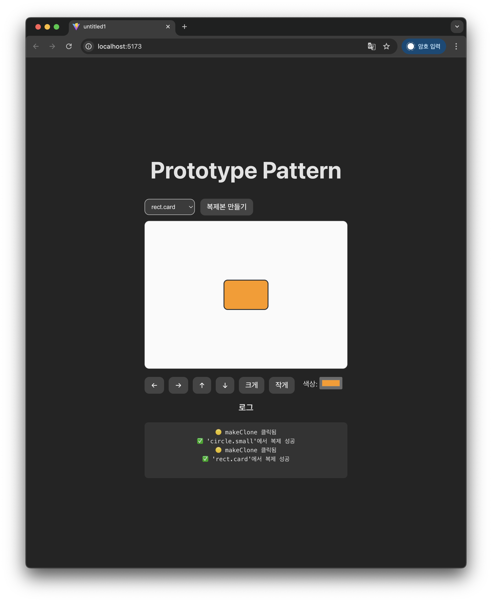
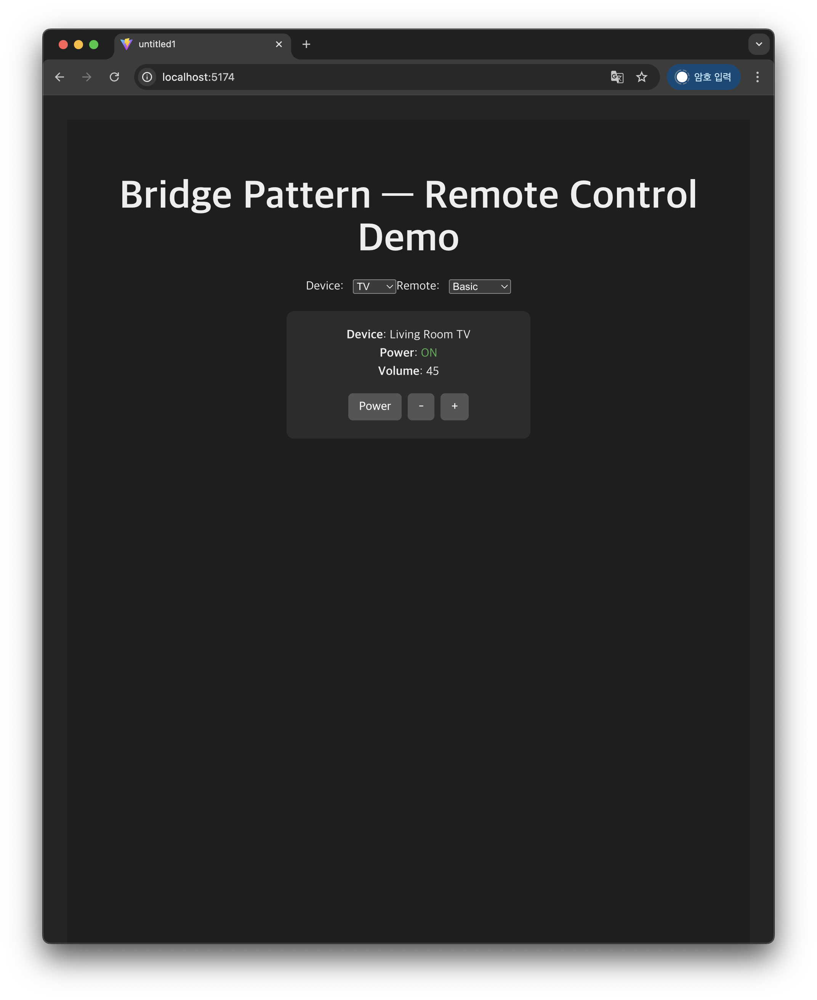
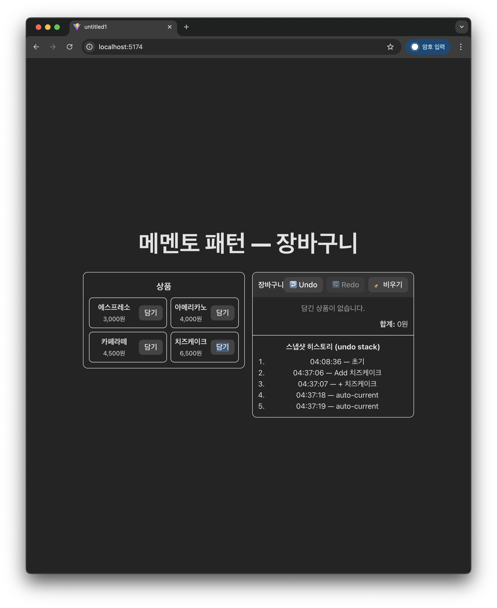

# 객체지향 디자인패턴

이 프로젝트는 **객체지향 디자인 패턴** 을  
Vue 3 + TypeScript 기반 UI를 통해 **직접 조작하면서 이해할 수 있도록** 만든 데모입니다.

---
### 현재 App.vue에는 prototype을 실행하기 위한 코드가 업로드 되어있습니다.  
### Appvue 폴더 내의 bridge.txt, memento.txt, prototype.txt 파일을 각각 App.vue로 복사하여 실행할 수 있습니다.

---

## 포함된 패턴 & 핵심 요약

| 패턴 | 목적 | 이 예제에서의 역할 |
|------|------|------------------|
| Prototype Pattern | 객체 생성 비용 절감, 동적 복제 | 캐릭터(Avatar)를 Clone 버튼으로 복제 |
| Bridge Pattern | 추상화와 구현의 독립적 확장 | 리모컨(추상)과 기기(TV/Radio)를 분리 |
| Memento Pattern | 상태 보존, Undo/Redo | 장바구니 상태 스냅샷 + 시간 되돌리기 |

---

# 1. Prototype Pattern

## Prototype 화면 조작 가이드

| UI 요소 | 설명 | 동작 예시 |
|--------|------|-----------|
| **프로토타입 선택 Select Box** | 복제할 원본 도형(원형/사각형)을 선택합니다. | `circle` 선택 → 원형 도형이 복제됨 |
| **복제본 만들기 버튼** | 선택한 프로토타입을 기반으로 새로운 도형을 복제합니다. | 클릭 시 도형이 중앙에 나타남 |
| **SVG 캔버스** | 현재 복제된 도형을 시각적으로 확인할 수 있는 캔버스입니다. | 도형 위치 변경에 따라 실시간 업데이트 |
| **← → ↑ ↓ 버튼** | 도형을 상하좌우로 이동합니다. | 클릭할 때마다 5px 이동 |
| **크게 버튼** | 도형의 크기를 증가시킵니다. | 원 → 반지름 증가 / 사각형 → width, height 증가 |
| **작게 버튼** | 도형의 크기를 감소시킵니다. | 최소 크기 제한 적용 |
| **색상 선택(Color input)** | 도형의 색상을 변경합니다. | 클릭하여 색상 선택 시 즉시 적용 |
| **로그 영역** | 사용자 동작을 기록합니다. | 복제 성공/실패, 클릭 이벤트 로그 확인 가능 |

---

## 어떻게 사용하는 화면인가요?

> **원본 객체(Prototype)를 선택 → 복제 → 복제된 객체를 조작해보기**

1. 드롭다운에서 `circle` 또는 `rect` 선택  
2. **복제본 만들기** 클릭 → 화면에 도형 등장  
3. 아래 버튼들로 위치/크기/색상 조절  
4. 로그 창에서 **Prototype 기반 생성이 이루어졌음**을 확인

---

## Prototype Pattern 핵심

| 패턴 개념 | UI에서 보여주는 방식 |
|---------|------------------|
| 기존 객체를 복제하여 새 객체 생성 | `복제본 만들기` 버튼 |
| 복제된 객체는 독립된 변경 가능 | 색상, 위치, 크기 변경해도 원본은 그대로 |
| 복잡한 객체 생성 비용 절감 | 원본 프로토타입만 정의하고 계속 복제 |

---

## 사용예제



---
# 2. Bridge Pattern — 기능 및 사용 방법 설명

## Bridge 화면 조작 가이드

| UI 요소 | 설명 | 동작 예시 |
|--------|------|-----------|
| **Device 선택** | TV 또는 Radio 중 하나 선택 | TV → 화면 장치 / Radio → 오디오 장치 |
| **Remote 선택** | Basic 또는 Advanced 리모컨 선택 | Advanced 선택 시 Mute 기능 활성화 |
| **Power 버튼** | 전원을 ON/OFF 전환 | 상태에 따라 텍스트 색상 변화 |
| **Volume - / + 버튼** | 볼륨 조절 기능 제공 | 클릭 시 볼륨 값 변경 표시 |
| **Mute 버튼** | Advanced Remote일 때만 표시, 음소거 적용 | 볼륨 0으로 설정 |

---

## 어떻게 사용하는 화면인가요?

> Device(장치)와 Remote(리모컨)를 **독립적으로 조합**하면서 기능 동작을 테스트합니다.

사용 순서 예시:  
1. Device: `TV` 선택  
2. Remote: `Basic` 선택  
3. Power & Volume 조작 확인  
4. Remote를 `Advanced`로 변경 → Mute 버튼 활성화  
5. Device를 `Radio`로 변경해도 Remote 기능 그대로 유지

---

## Bridge Pattern 핵심 개념 시각화

| 패턴 개념 | UI 동작으로 확인되는 부분 |
|---------|------------------|
| 기능과 구현을 분리 | Device와 Remote를 각각 선택할 수 있음 |
| 구현 변경과 기능 변경이 독립적 | Device 변경되어도 Remote는 그대로 유지 |
| 런타임 조합 가능 | Device × Remote = 모든 조합 가능 |
| 코드 재사용 극대화 | 한쪽 확장 시 다른 쪽 수정 불필요 |

```
(기능 계층) Remote → Basic, Advanced
                      ↑
                    Bridge
                      ↓
(구현 계층) Device → TV, Radio
```

---

## 사용예제



---
# 3. Memento Pattern

## 장바구니 화면 조작 가이드

| UI 요소 | 설명 | 동작 예시 |
|--------|------|-----------|
| **상품 목록** | 샘플 음료 & 디저트 목록 | ‘담기’ 클릭 → 장바구니에 추가 |
| **수량 조절 -/+ 버튼** | 상품 수량 변경 | 클릭 시 qty ±1 |
| **삭제 버튼** | 해당 상품을 장바구니에서 제거 | Undo로 복구 가능 |
| **비우기 버튼🧹** | 장바구니 전체 초기화 | Snapshot 저장 & Undo로 복구 |
| **Undo / Redo 버튼** | 이전/이후 상태를 복원 | 최대 200개까지 상태 기록 |
| **합계 표시** | 총 금액 자동 계산 | 변경 시 즉시 업데이트 |
| **스냅샷 히스토리** | 저장된 장바구니 상태 확인 | 시간 및 태그 표시 |

---

## 어떻게 사용하는 화면인가요?

> 장바구니 변경 상태를 “자동 저장 & 복원(Undo/Redo)”할 수 있습니다.

체험 흐름 예시:

1. `담기` → 수량 조절 → 합계 변화 확인  
2. `↩️ Undo` → 직전 상태로 롤백  
3. `↪️ Redo` → 되돌렸던 변경 다시 적용  
4. `🧹 비우기` → 전체 삭제됨  
5. Undo → 다시 모두 복구

각 동작 시 자동으로 Memento 스냅샷이 저장되며  
히스토리에서 기록을 확인할 수 있습니다.

---

## Memento Pattern 핵심 개념

| 패턴 개념 | UI에서의 표현 |
|---------|----------------|
| Originator: 내부 상태를 저장 | Cart(장바구니) |
| Memento: 저장된 스냅샷 객체 | cart.getState() 결과 |
| Caretaker: Memento stack 관리 | caretaker.save / undo / redo |


---

## 사용예제



---
##  폴더 구조

```
Appvue/
 ├─ bridge.txt
 ├─ memento.txt
 ├─ prototype.txt
src/
 ├─ prototype/
 │   ├─ prototype.ts
 ├─ bridge/
 │   ├─ bridge.ts
 ├─ memento/
 │   ├─ memento.ts   
 ├─ 기본 예제 6가지
 ├─ App.vue
 ├─ main.ts
 
```
---